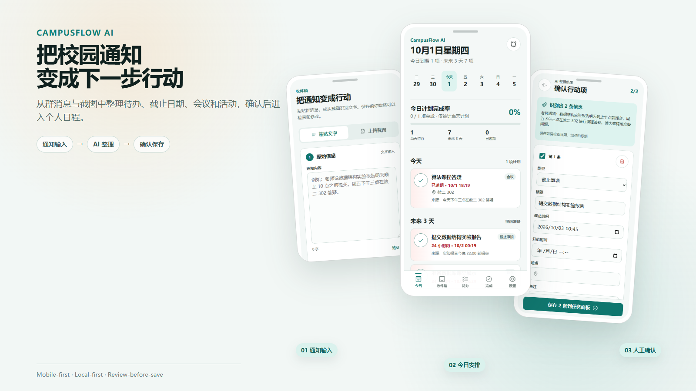
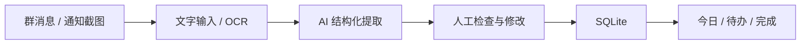
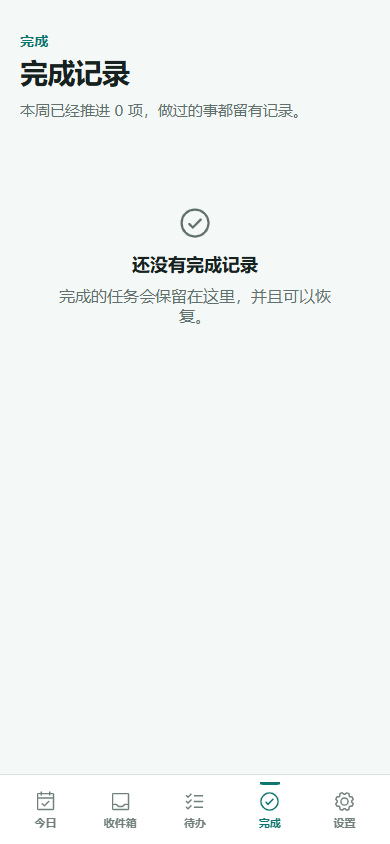

# CampusFlow AI

**校园信息整理与行动助手**

将群聊文字和聊天截图中的待办、截止日期、会议与活动整理成可确认、可追踪的个人任务。

[](https://github.com/xuyang2005cs/campusflow-ai/actions/workflows/ci.yml)




## 项目简介

CampusFlow AI 面向课程群、实验室和社团通知带来的信息过载。它将用户主动粘贴的文字或上传的截图转换为结构化行动项；每一项结果都可以在确认页修改或取消选择，确认后才会写入本地 SQLite 任务库。产品围绕任务与截止日期组织信息，而不是保留聊天记录。

## 使用流程



## 核心能力

| 能力 | 内容 |
|---|---|
| 信息输入 | 通知文字粘贴；PNG、JPG、WEBP 截图；中英文 OCR；识别文本可编辑 |
| AI 整理 | Sign in with ChatGPT；Structured Output；相对时间解析；TypeBox Schema 校验 |
| 任务管理 | Today 日程；截止紧急度；完成与恢复；SQLite 本地持久化 |
| 工程质量 | Mobile-first PWA；Vitest；Playwright；GitHub Actions CI |

## 产品界面

<table>
  <tr>
    <td align="center"><strong>通知输入</strong><br></td>
    <td align="center"><strong>AI 提取确认</strong><br></td>
  </tr>
  <tr>
    <td align="center"><strong>待办日程</strong><br></td>
    <td align="center"><strong>完成记录</strong><br></td>
  </tr>
</table>

桌面端沿用同一信息架构，通过紧凑侧轨和受控内容宽度扩展：[查看桌面界面](docs/images/today-desktop.png)。

## AI 集成

CampusFlow AI 使用 `@earendil-works/pi-ai` 接入 OpenAI provider，并通过 **Sign in with ChatGPT** 完成 OAuth 授权。通知文本会结合本地时间与时区进入结构化提取流程，模型输出经过 TypeBox Schema 校验后进入 Review 页面，由用户确认后写入 SQLite。

提取结果支持 `task`、`deadline`、`meeting` 与 `event`，并保留 `original_time_text`、`source_excerpt` 和 `confidence`，便于用户核对时间表达、来源片段与结果可信度。OAuth credential 只保存在本机服务端，不会进入浏览器存储或业务数据表。

## 技术架构

```text
React + Vite + TypeScript
        ↓ local API
Node.js + Hono
   ├── Tesseract.js OCR
   ├── Pi AI / OpenAI OAuth + Structured Output
   └── SQLite tasks + imports
```

完整架构与安全边界见 [系统架构](docs/architecture/system-architecture.md)。

## 本地数据

任务与导入记录保存在本地 SQLite；OAuth credential 与稳定 installation ID 保存在 Git 忽略的本地目录中。上传的原始截图不持久化。

## 自动化测试

| Suite | Result | Scope |
|---|---:|---|
| Vitest | 35 passed | SQLite、任务状态、紧急度、API、导入、Schema 与 AI 错误映射 |
| Playwright | 6 passed | Router、移动导航、任务生命周期、OCR 编辑与 Review 确认 |
| Total | **41 passed** | 单元、集成与真实浏览器流程 |

```bash
npm test
npm run test:e2e
```

## 快速开始

需要 Node.js 22.19.0 或更高版本。

```bash
npm install
npm run dev
```

打开 `http://127.0.0.1:5173`。

生产构建：

```bash
npm run build
npm run start
```

## 项目结构

```text
src/client        React 页面与组件
src/server        Hono API、SQLite 与 AI/OAuth
src/shared        共享模型与截止紧急度
tests             Vitest 与 Playwright
docs              架构、设计、开发记录和产品截图
public            PWA manifest、图标与 Service Worker
```

## 文档

- [产品定义](PRODUCT.md)
- [设计系统](DESIGN.md)
- [系统架构](docs/architecture/system-architecture.md)
- [核心流程开发记录](docs/development/phase-02-core-loop.md)

## License

[MIT](LICENSE)
