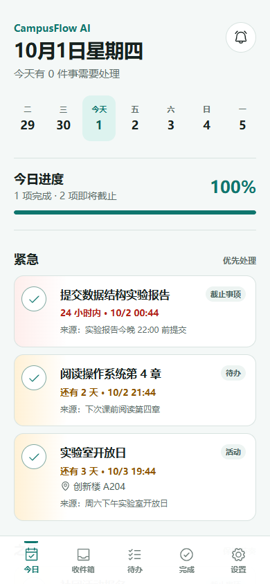
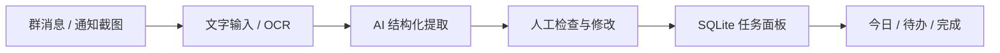
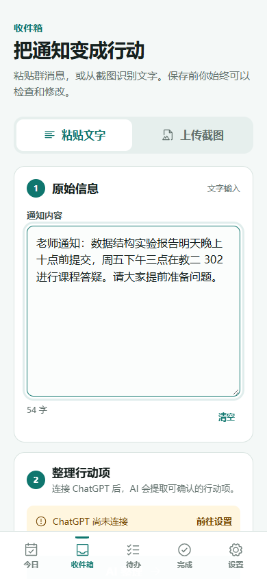
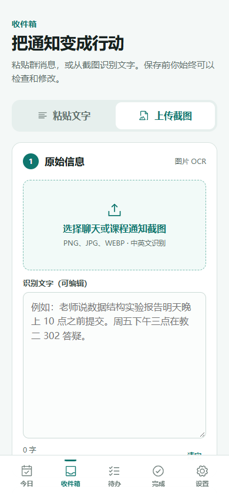
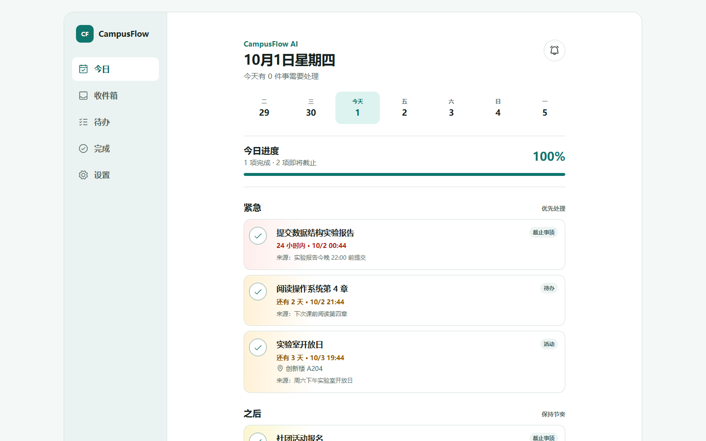
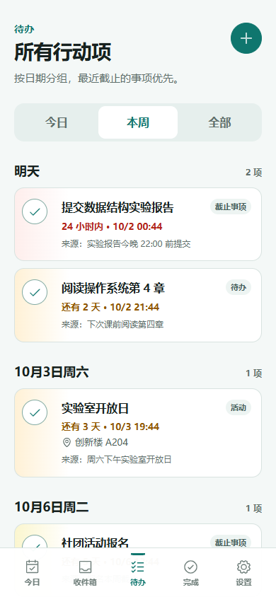

# CampusFlow AI

**校园信息整理与行动助手**

将群聊文字和聊天截图中的待办、截止日期、会议与活动，整理成可确认、可追踪的个人任务。

[](https://github.com/xuyang2005cs/campusflow-ai/actions/workflows/ci.yml)


<p align="center"></p>

## 项目简介

CampusFlow AI 面向课程群、实验室和社团通知带来的信息过载。它把用户主动粘贴的文字或上传的截图转换为结构化行动项；AI 结果必须经过可编辑的确认页面，才会写入本地 SQLite 任务库。产品以任务和截止日期为中心，不以聊天记录为中心。

## 使用流程



## 核心功能

- 移动端优先的 Today 日程、七日日期条与截止紧急度
- 手动创建、完成、恢复和按日期分组的任务管理
- PNG、JPG、WEBP 截图的中英文 Tesseract.js OCR
- OCR 文本编辑后再进入 AI 整理
- Pi AI OpenAI provider 与 **Sign in with ChatGPT** OAuth
- TypeBox Structured Output、相对时间上下文与结果校验
- Review 中逐项编辑、取消选择和确认保存
- SQLite 重启持久化与重复确认保护
- PWA manifest、Service Worker 与桌面自适应布局

## 产品界面

<table>
  <tr>
    <td align="center"><strong>通知整理</strong><br></td>
    <td align="center"><strong>截图 OCR</strong><br></td>
  </tr>
  <tr>
    <td align="center"><strong>AI Review</strong><br></td>
    <td align="center"><strong>待办日程</strong><br></td>
  </tr>
</table>

桌面端保留同一信息架构，通过紧凑侧轨和受控内容宽度扩展：[查看桌面截图](docs/images/today-desktop.png)。

## AI 集成

应用使用 `@earendil-works/pi-ai` 的 OpenAI provider、模型目录和 OAuth abstraction。设置页启动 **Continue with ChatGPT**，授权在 OpenAI 页面完成；服务端保存 OAuth credential，浏览器 JavaScript、业务表、日志和 Git 均不会接收 Token。

每次提取都会向模型传入当前本地时间和时区。模型通过约束工具返回 `task | deadline | meeting | event`，并保留原始时间文字、来源摘录与置信度。不确定日期保持为空，最终写库由用户确认决定。

## 技术架构

```text
React + Vite + TypeScript
        ↓ local API
Node.js + Hono
   ├── Tesseract.js OCR（浏览器）
   ├── Pi AI / OpenAI OAuth + Structured Output
   └── SQLite tasks + imports
```

完整架构与安全边界见 [系统架构](docs/architecture/system-architecture.md)。

## 本地数据

- `data/campusflow.db`：任务与导入记录
- `.local/auth.json`：服务端 OAuth credential store
- `.local/installation-id`：稳定的本机 installation ID

以上文件均被 `.gitignore` 排除。首版不持久化上传的原始截图。

## 自动化测试

| Suite | Result | Scope |
|---|---:|---|
| Vitest | 35 passed | SQLite、任务状态、紧急度、API、导入、Schema、AI 错误映射 |
| Playwright | 6 passed | Router、底部导航、创建/完成/恢复、OCR 编辑、Review、OAuth 断开状态 |

```bash
npm test
npm run test:e2e
```

## 快速开始

需要 Node.js 22.19.0 或更高版本。

```bash
npm install --legacy-peer-deps
npm run dev
```

打开 `http://127.0.0.1:5173`。开发模式会加载合成课程任务；正式数据库文件不会进入 Git。

生产构建：

```bash
npm run build
npm run start
```

## 项目结构

```text
src/client        React 页面与组件
src/server        Hono API、SQLite 与 AI/OAuth
src/shared        共享模型与截止紧急度
tests             Vitest 与 Playwright
docs              架构、设计、开发记录和真实截图
public            PWA manifest、图标与 Service Worker
```

## 文档

- [产品定义](PRODUCT.md)
- [设计系统](DESIGN.md)
- [系统架构](docs/architecture/system-architecture.md)
- [Phase 0–2 开发记录](docs/development/phase-02-core-loop.md)
- [设计工具与版本](docs/design/tooling-setup.md)

## License

[MIT](LICENSE)
