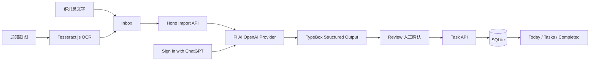

# 系统架构

CampusFlow AI 采用单一 TypeScript 全栈进程：React 提供移动端优先的交互界面，Hono 提供本地 API，SQLite 保存导入记录和任务。OCR 在浏览器端执行；AI OAuth、凭据与模型调用留在服务端。

## 安全边界

- OAuth access / refresh token 由服务端的 Pi `CredentialStore` 写入 `.local/auth.json`，不返回浏览器。
- 稳定 installation ID 位于 `.local/installation-id`，与业务表分离并被 Git 忽略。
- 上传图片只在浏览器端交给 Tesseract.js；首版不将原始截图写入数据库。
- AI 提取结果先写入 `imports` 供 Review，只有确认选中的条目才进入 `tasks`。

## 数据模型

`tasks` 保存任务类型、标题、截止/开始时间、地点、说明、状态、来源、置信度和完成时间。`imports` 保存输入类型、原始/OCR 文本、提取状态及 Review 候选结果。任务完成通过 `status=completed` 与 `completed_at` 表达，不删除记录。
